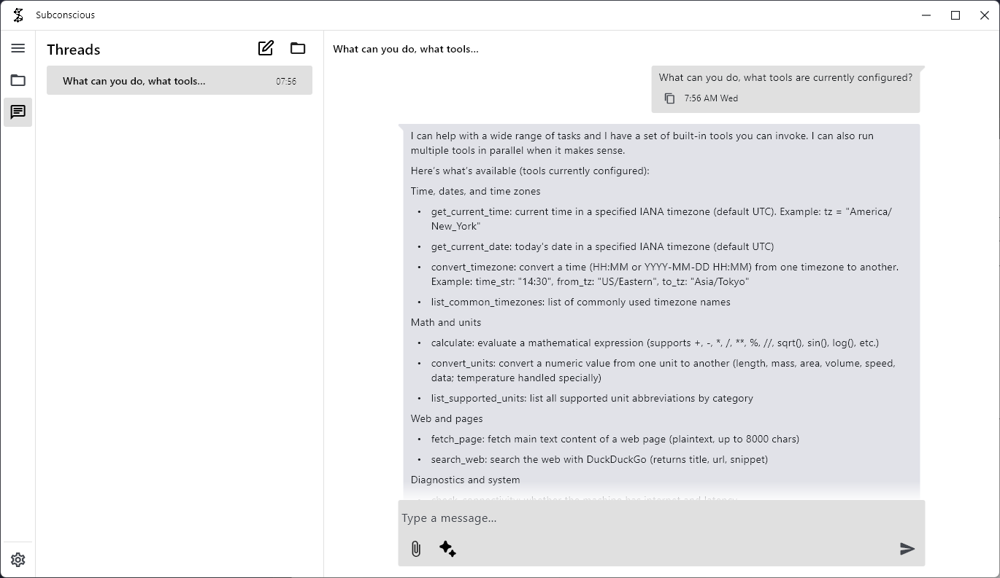
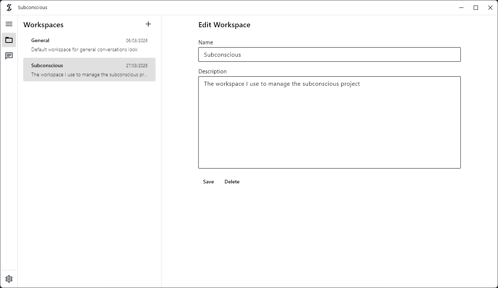

# Subconscious — Your Distributed AI Agent

<div align="center">
  
</div>

<p align="center">
  <em>A distributed, agentic AI platform that allows you to create AI agents running everywhere, on every device, at the same time.</em><br>
  <b>An open-source alternative to ChatGPT, Claude & Grok; A packaged alternative to Open Claw & Open WebUI</b>
</p>

<p align="center">
  <a href="https://github.com/Ancilla-Company/Subconscious/actions">
    
  </a>
  <a href="https://github.com/Ancilla-Company/Subconscious/stargazers">
    
  </a>
  <a href="https://pypi.org/project/subconscious-chat/">
    
  </a>
  <a href="https://subconscious.chat/docs">
    
  </a>
</p>

<div align="center">
  
</div>

## ✨ Key Features

- **🔒 Local-First Architecture**: Your data is exclusively yours. All chats, logs, and settings are stored locally.
- **🖥️ Run Local Models**: Execute models completely offline using powerful local servers like **Ollama**.
- **🔑 Bring Your Own Keys (BYOK)**: Use your own API keys to connect to the models of your choice.
- **🛠️ Built-in Tools Out-of-the-Box**: Outfitted with numerous handy local tools. Just ask your Subconscious what it can do! Manage access natively inside settings. Currently supports: `Terminal`, `FileSystem`, `Calculator`, `Clipboard`, `Contacts`, `Time`, `Weather`, `Web Tools`, and more!
- **📱 True Multi-Platform Support**: Works beautifully via Python and Windows executables out-of-the-box.
- **🔄 Auto-Updates**: Subconscious automatically checks for the latest features, with a convenient one-button seamless update.
- **🧵 Agentic Threads**: Create varied threads/chats/agents for distinct purposes; fine-tune context effortlessly.
- **📁 Workspaces**: Keep organized. Compartmentalize your threads by workspace for related themes, such as 'Work', 'Personal', or a special side-project.
- **⏱️ To-Dos & Scheduled Tasks**: Delegate routine chores. Let your agent maintain a to-do list or schedule tasks for exact execution times.

<div align="center">
  
</div>

---

## 🚀 Getting Started Flow

Subconscious is designed to be as ubiquitous as you are. Use your phone to execute a process on your VPS, or operate Subconscious in your terminal while browsing.

### Installation (Recommended)

#### Microsoft Windows (via Winget)

The fastest way to install the Subconscious Desktop App natively on Windows:

```shell
winget install subconscious-chat

```

#### Via Python Pip

For Mac, Linux, and Windows users comfortable with Python:

Create and activate a new Python environment (e.g., using `venv` or `conda`), then install via PyPI:

```shell
pip install -U subconscious-chat

```

_Note: If using pip, you will need Python 3.12 or newer._

### 🛠️ From Source (Development)

Love tinkering? Getting Subconscious running locally via source is easy.

```shell
git clone https://github.com/Ancilla-Company/Subconscious.git
cd Subconscious

# Alternatively, use the included VS Code Task "Pip Install Editable"

pip install -e .

```

<div align="center">
  
</div>

---

## Supported Models

With our native integration to the best APIs and local servers, Subconscious flexibly connects to:

- **OpenAI** (GPT-4o, etc)
- **Anthropic** (Claude 3.5 Sonnet/Opus, etc)
- **Google GenAI** (Gemini)
- **Ollama** (Llama-3, Phi, Mistral — 100% Offline)
- **DeepSeek**
- **Mistral**
- **Groq**
- **Grok**
- **Hugging Face**

---

## Running Subconscious

### Desktop App

If you installed the Winget package or built the binary via Nuikta/PyInstaller, simply launch **Subconscious** from your Start menu / App launcher!

### CLI / Python

Once installed via pip, start the agent directly:

```shell
subconscious

```

---

## 🗺️ Roadmap & Highlights

We are shipping fast. Here is a glimpse of what's currently being integrated:
- **Swarm Access**: Start on one device and continue from another. Begin a task in your browser and seamlessly transition to your phone.
- **Agentic Threads**: Create varied threads/chats/agents for distinct purposes. Assign specific tools and fine-tune context effortlessly.
- **True Multi-Platform Support**: Web, Linux, MacOS, Browser, Android and iOS are actively coming soon!
- **Custom & External Tools**: Built in Python natively, meaning extending Subconscious with your own tools is a breeze. Connect to external APIs or services to supercharge your workflow.
- **More Models Coming Soon**: We are actively working on expanding support for as many models as possible.
- **Voice Input Button**: Speak directly to Subconscious with accompanying outputs/animations.
- **Computer Interaction Tools**: Allow the AI to control mouse/keyboard using computer usage agent protocols.
- **Directory RAG System**: Instantly query your local filesystem docs.
- **Mini Mode / Always-On-Top**: Perfect for persistent UI integration while researching.
- **MCP Server Connections**: Next-gen integrations for extended memory and actions.

## 🤝 Contributions

Subconscious is open source and community-driven! We welcome bug reports, pull requests, and ideas. Please check out the issues tab or submit a PR for a feature from the roadmap.

## 📜 License

This project is open-source and available to the community.
